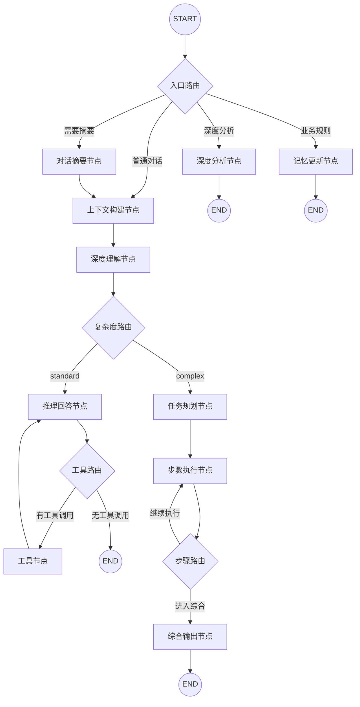

# Conversation Agent 技术架构文档

> 版本: v3.9 | 更新日期: 2026-01-26 | 框架: LangGraph 1.0
> 
> **目标读者**: AI 专家，用于技术讨论与优化

---

## 一、系统概述

### 1.1 核心定位

**首公里智能排班助手**是一个基于 LangGraph 1.0 的**生产级对话 Agent 系统**，专为国际物流仓库运营场景设计。

**核心能力**：
- 双路径对话流程（Standard + Complex）
- 数据查询与分析（预测/实际/综合）
- 知识图谱监控（18个KG工具）
- 小时级流速分析
- 用户记忆系统（个性化推理）
- Human-in-the-Loop 审批

### 1.2 技术栈

| 组件 | 技术选型 | 说明 |
|------|----------|------|
| Agent 框架 | LangGraph 1.0.3 | StateGraph + Checkpointer + Store |
| LLM | Qwen (通义千问) | qwen_analysis（推理）+ qwen_fast（分类） |
| 向量嵌入 | text-embedding-v4 | 1536维，异步调用支持 |
| 持久化 | PostgreSQL 14+ | AsyncPostgresSaver + AsyncPostgresStore |
| 图数据库 | PolarDB AGE | Apache AGE 兼容，Cypher 查询 |
| 流式输出 | FastAPI SSE | StreamingResponse + get_stream_writer() |

---

## 二、LangGraph 工作流架构

### 2.1 工作流图（Mermaid）



### 2.2 双路径设计

| 路径 | 适用场景 | 节点流程 | 典型耗时 |
|------|----------|----------|----------|
| **Standard** | 简单问题（单一意图、单次工具调用） | context → understand → reason → tool ↺ → END | 1-3s |
| **Complex** | 复杂问题（多意图、多步骤、对比分析） | context → understand → plan → step ↺ → synthesize → END | 5-15s |

---

## 三、状态定义（State Schema）

### 3.1 核心状态结构

```python
# /app/agent/core/schemas.py

class ConversationState(MessagesState):
    """对话状态 - 继承官方 MessagesState"""
    
    # 增强上下文（context_node 写入）
    enriched_context: NotRequired[EnrichedContext]
    
    # 用户记忆上下文（context_node 写入，v3.8 新增）
    user_memory_context: NotRequired[UserMemoryContext]
    
    # 理解结果（understand_node 写入）
    understanding: NotRequired[UnderstandingResult]
    
    # 执行计划（plan_node 写入，Complex 路径）
    execution_plan: NotRequired[ExecutionPlan]
    
    # 中间结果（step_node 追加，Complex 路径）
    intermediate_results: NotRequired[List[IntermediateResult]]
```

### 3.2 关键类型定义

```python
class UnderstandingResult(TypedDict):
    """understand_node 输出"""
    intent: Literal["query_data", "analyze_trend", "compare", "optimize", "general_qa"]
    high_level_goal: str                    # 一句话任务描述
    entities: ExtractedEntities             # 提取的实体
    complexity: Literal["standard", "complex"]
    complexity_reason: str
    requires_data: bool
    sub_questions: List[str]                # 仅 complex 时填充
    followup_suggestions: List[str]         # LLM 建议

class ExecutionPlan(TypedDict):
    """plan_node 输出"""
    goal: str
    steps: List[PlanStep]
    current_step_index: int
    max_steps: int                          # 防死循环，默认5
    status: Literal["planning", "executing", "completed", "failed"]

class PlanStep(TypedDict):
    """执行计划步骤"""
    id: str
    description: str
    action: Literal["query", "analyze", "compare", "synthesize"]
    tool_name: Optional[str]
    tool_args: Optional[Dict[str, Any]]
    depends_on: List[str]
    status: Literal["pending", "running", "completed", "failed"]
```

### 3.3 运行时上下文（context_schema）

```python
@dataclass
class WarehouseContextSchema:
    """静态运行时上下文 - invoke() 时传入"""
    user_id: str = "default"
    session_id: str = "default"
    warehouse_code: Optional[str] = None
    warehouse_name: Optional[str] = None
```

---

## 四、节点详解

### 4.1 节点总览

| 节点 | 文件 | 行数 | 职责 | 路径 |
|------|------|------|------|------|
| `context_node` | nodes/context_node.py | 670 | 上下文构建 + 用户记忆加载 | 共用 |
| `understand_node` | conversation_agent/nodes/understand_node.py | 933 | 意图识别 + 实体提取 + 复杂度评估 | 共用 |
| `reason_node` | conversation_agent/nodes/reason_node.py | 525 | CoT 推理 + 工具调用 | Standard |
| `plan_node` | conversation_agent/nodes/plan_node.py | 1236 | 任务规划 + 执行计划生成 | Complex |
| `step_node` | conversation_agent/nodes/step_node.py | 761 | 步骤执行（循环） | Complex |
| `synthesize_node` | conversation_agent/nodes/synthesize_node.py | 475 | 结果汇总 + 最终回答 | Complex |
| `deep_analysis_node` | conversation_agent/nodes/deep_analysis_node.py | 2782 | 环节/班组深度分析 | 特殊触发 |
| `tool_node` | LangGraph ToolNode | - | 工具执行 | Standard |
| `summarize_conversation` | nodes/conversation_summary_node.py | 391 | 对话历史压缩 | 系统级 |
| `update_memory` | nodes/update_memory_node.py | 648 | 业务规则管理 + HITL | HITL |

---

### 4.2 context_node（上下文构建节点）

**文件**: `/app/agent/nodes/context_node.py`

**职责**:
1. 从 `runtime.context` 获取仓库静态上下文
2. 从消息中提取仓库覆盖
3. 从缓存加载仓库基本信息
4. 向量知识检索（异步）
5. **v3.8 新增**：用户记忆加载与注入

**核心技术实现**:

```python
async def async_context_node(state, *, runtime):
    # 1. 获取静态上下文
    warehouse_code = runtime.context.warehouse_code
    user_id = runtime.context.user_id
    
    # 2. 从消息识别仓库覆盖
    message_warehouse = extract_warehouse_from_message(current_message)
    
    # 3. 用户记忆加载（根据消息决定策略）
    memory_strategy = MemoryRouter.determine_strategy(current_message)
    user_memory_context = await _load_user_memory(runtime.store, user_id, memory_strategy)
    
    # 4. 异步向量知识检索
    retrieved_knowledge = await async_load_warehouse_knowledge(
        runtime.store, warehouse_code, current_message, limit=5
    )
    
    # 5. 构建 system_prompt + 注入用户记忆
    system_prompt = build_dynamic_system_prompt(...)
    user_aware_section = _build_user_aware_prompt_section(user_memory_context)
    
    return {
        "enriched_context": enriched_context,
        "user_memory_context": user_memory_context
    }
```

**记忆加载策略**:
- `STANDARD`: profile + activity（大多数场景）
- `FULL`: profile + activity + history（涉及历史/趋势时）

---

### 4.3 understand_node（深度理解节点）

**文件**: `/app/agent/agents/conversation_agent/nodes/understand_node.py`

**职责**:
1. 意图识别（5类）
2. 实体提取（仓库、时间、方向、指标）
3. **复杂度评估**（决定路由）
4. v3.7 新增：high_level_goal + followup_suggestions

**混合策略**:
- **规则层**：快速关键词/模式匹配
- **LLM 层**：结构化输出（Pydantic Schema）

**复杂度判断规则**:

```python
# 规则层快速判断
COMPLEX_KEYWORDS = [
    "对比", "比较", "分析", "趋势", "变化", "优化", "规划",
    "为什么", "如何改进", "建议", "报告", "历史", "瓶颈"
]

COMPLEX_PATTERNS = [
    r"对比.+和.+",           # 对比 A 和 B
    r"分析.+趋势",           # 分析 X 趋势
    r"为什么.+(低|高|慢|快)",  # 根因分析
]

def quick_complexity_check(message: str) -> Optional[str]:
    # 短消息 + 无复杂关键词 = standard
    if len(message) < 30 and not any(kw in message for kw in COMPLEX_KEYWORDS):
        return "standard"
    
    # 2+ 复杂关键词 = complex
    if sum(1 for kw in COMPLEX_KEYWORDS if kw in message) >= 2:
        return "complex"
    
    # 规则无法确定 → LLM 判断
    return None
```

**LLM 结构化输出（v3.7 with_structured_output）**:

```python
class UnderstandingSchema(BaseModel):
    intent: Literal["query_data", "analyze_trend", "compare", "optimize", "general_qa"]
    high_level_goal: str = Field(min_length=5, max_length=200)
    complexity: Literal["standard", "complex"]
    requires_data: bool
    followup_suggestions: List[str] = Field(default_factory=list)
    
    @field_validator("high_level_goal")
    def validate_goal(cls, v):
        # 过滤无意义的默认值
        invalid_defaults = ["回答用户的问题", "处理用户请求"]
        if v.strip() in invalid_defaults:
            raise ValueError("high_level_goal 不能是默认值")
        return v.strip()

# 使用 with_structured_output 绑定 Schema
structured_model = qwen_fast.with_structured_output(
    UnderstandingSchema,
    method="function_calling"
)
```

**模型选择**:
- 使用 `qwen_fast`（qwen-turbo, temperature=0, max_tokens=200）
- 快速、确定性输出，专注路由判断

---

### 4.4 reason_node（推理回答节点 - Standard 路径）

**文件**: `/app/agent/agents/conversation_agent/nodes/reason_node.py`

**职责**:
1. 读取 understanding + enriched_context
2. 基于意图构建专用 CoT 提示
3. 工具调用决策
4. **v3.9 新增**：工具使用记录

**意图专用 CoT 模板**:

```python
INTENT_SPECIFIC_COT_TEMPLATES = {
    "query_data": """
## 🧠 数据查询推理框架
### 查询思考过程
1. **识别数据维度**：仓库、时间范围、业务方向、环节
2. **选择查询工具**：根据维度选择合适的工具
3. **解析查询结果**：提取关键数据字段
4. **格式化输出**：使用表格展示对比数据

### ⚠️ 数据查询约束
- **严禁编造数据**：所有数据必须来自工具调用结果
""",
    
    "analyze_trend": """...""",
    "compare": """...""",
    "optimize": """...""",
    "general_qa": """...""",
}
```

**工具调用循环**:
```
reason_node → tool_calls? → tool_node → reason_node → ... → END
```

---

### 4.5 plan_node（任务规划节点 - Complex 路径）

**文件**: `/app/agent/agents/conversation_agent/nodes/plan_node.py`

**职责**:
1. 读取 understanding（复杂问题分析）
2. 动态注入工具列表到提示词
3. 使用 LLM 生成结构化执行计划
4. 验证并规范化计划

**动态工具注入**:

```python
def create_plan_node(model=None, tools: List[BaseTool] = None):
    # 动态生成工具描述
    tool_descriptions = _generate_tool_descriptions(tools)
    graph_schema = _get_graph_schema_for_planning()
    
    dynamic_system_prompt = PLANNING_PROMPT.format(
        tool_descriptions=tool_descriptions,
        graph_schema=graph_schema
    )
```

**执行计划示例**:

```json
{
  "goal": "分析华南东莞新马集运仓作业环节的依赖关系",
  "steps": [
    {
      "id": "step_1",
      "description": "获取仓库所有作业环节",
      "action": "query",
      "tool_name": "get_warehouse_stages",
      "tool_args": {"warehouse_id": "20142001"},
      "depends_on": []
    },
    {
      "id": "step_2",
      "description": "查询上架环节上下游依赖",
      "action": "query",
      "tool_name": "get_stage",
      "tool_args": {"stage_id": "20142001_shelving_stage", "include_upstream": true},
      "depends_on": ["step_1"]
    },
    {
      "id": "step_3",
      "description": "综合分析环节依赖关系",
      "action": "synthesize",
      "depends_on": ["step_2"]
    }
  ]
}
```

**Action 类型**:
- `query`: 调用工具查询数据
- `analyze`: LLM 分析数据
- `compare`: LLM 对比分析
- `synthesize`: 综合生成最终回答

---

### 4.6 step_node（步骤执行节点 - Complex 路径）

**文件**: `/app/agent/agents/conversation_agent/nodes/step_node.py`

**职责**:
1. 读取 execution_plan.current_step_index
2. 根据 action 类型执行对应操作
3. 将结果追加到 intermediate_results
4. 更新步骤状态和索引
5. **v3.9 新增**：工具使用记录

**循环执行机制**:

```python
def route_step(state) -> str:
    execution_plan = state.get("execution_plan")
    current_index = execution_plan.get("current_step_index", 0)
    steps = execution_plan.get("steps", [])
    max_steps = execution_plan.get("max_steps", 5)
    
    # 终止条件
    if current_index >= len(steps) or current_index >= max_steps:
        return "synthesize_node"
    
    # 下一步是 synthesize
    if steps[current_index].get("action") == "synthesize":
        return "synthesize_node"
    
    return "step_node"  # 继续循环
```

**工具执行优化（v3.3）**:

```python
# O(1) 字典查找（替代 O(n) 线性搜索）
tool_map = {getattr(t, 'name', ''): t for t in available_tools}

async def _execute_tool(tool_name, tool_args, tool_map):
    tool = tool_map.get(tool_name)
    if not tool:
        return {"success": False, "error": f"工具 {tool_name} 不存在"}
    return await tool.ainvoke(tool_args)
```

---

### 4.7 synthesize_node（综合输出节点 - Complex 路径）

**文件**: `/app/agent/agents/conversation_agent/nodes/synthesize_node.py`

**职责**:
1. 读取 intermediate_results
2. 格式化中间结果供 LLM 综合
3. **v3.10 新增**：消费用户完整记忆
4. 生成用户友好的最终回答

**用户记忆消费（v3.10）**:

```python
def _format_user_context(state):
    user_memory = state.get("user_memory_context")
    if user_memory:
        # 1. 用户偏好（必须遵循）
        preferences = user_memory.get("profile", {}).get("preferences", [])
        
        # 2. 高频操作（供参考）
        frequent_actions = user_memory.get("activity", {}).get("frequent_actions", [])
        
        # 3. 历史对话（供参考）
        history_entries = user_memory.get("history", {}).get("entries", [])
```

---

## 五、路由逻辑

### 5.1 入口路由（route_entry）

```python
def route_entry(state):
    """
    路由优先级：
    1. 深度分析触发（message_kwargs.type == "deep_analysis"）
    2. 对话摘要检查（token/消息数阈值）
    3. 业务规则管理关键词
    4. 默认：普通对话
    """
    # 1. 深度分析
    if msg_type == "deep_analysis":
        return "deep_analysis_node"
    
    # 2. 摘要
    if should_summarize_conversation(state) == "summarize":
        return "summarize_conversation"
    
    # 3. 业务规则
    memory_keywords = ["添加业务规则", "添加规则", "保存规则"]
    if any(kw in content for kw in memory_keywords):
        return "update_memory"
    
    # 4. 默认
    return "context_node"
```

### 5.2 复杂度路由（route_complexity）

```python
def route_complexity(state):
    understanding = state.get("understanding")
    complexity = understanding.get("complexity", "standard")
    
    if complexity == "complex":
        return "plan_node"    # Complex 路径
    return "reason_node"      # Standard 路径
```

### 5.3 工具路由（route_tools）

```python
def route_tools(state):
    last_message = state["messages"][-1]
    if hasattr(last_message, 'tool_calls') and last_message.tool_calls:
        return "tool_node"
    return END
```

---

## 六、工具集

### 6.1 数据查询工具

| 工具名 | 功能 | 数据范围 |
|--------|------|----------|
| `query_orders_data_by_date_range` 🔥 | 统一查询预测/实际/综合数据 | 仓库级别 |
| `query_single_day_hourly_distribution_tool` | 单日24小时流速分布 | 环节级别 |
| `query_multi_day_hourly_distribution_tool` | N天平均流速分布 | 环节级别 |
| `predict_hourly_distribution_tool` | 小时级预测 | 环节级别 |

### 6.2 知识图谱工具（18个）

| 类别 | 工具 | 功能 |
|------|------|------|
| 基础查询 | `get_warehouse_info`, `get_warehouse_stages` | 仓库/环节基础信息 |
| 统一查询 | `get_stage` 🔥 | 环节多维度查询（状态/依赖/班组） |
| 实时状态 | `get_stage_current_status`, `get_warehouse_realtime_overview` | 实时快照 |
| 班组状态 | `get_team`, `get_warehouse_work_groups` | 班组信息与状态 |
| 仓库汇总 | `get_warehouse_overview` 🔥 | 全景视图 + 智能分析 |
| 智能分析 | `detect_stage_anomalies`, `generate_allocation_suggestion` | 异常检测/调度建议 |

---

## 七、存储层架构

### 7.1 PostgreSQLManager 单例

```python
class PostgreSQLManager:
    """全局连接池管理"""
    
    async def initialize(self):
        # 1. 创建 AsyncConnectionPool
        self._connection_pool = AsyncConnectionPool(
            min_size=5, max_size=20,
            timeout=30, max_idle=300, max_lifetime=1800
        )
        
        # 2. 创建 Checkpointer（短期记忆）
        self._checkpointer = AsyncPostgresSaver(self._connection_pool)
        await self._checkpointer.setup()
        
        # 3. 创建 Store（长期记忆 + 向量索引）
        self._store = AsyncPostgresStore(self._connection_pool, index=vector_config)
        await self._store.setup()
```

### 7.2 记忆系统命名空间

| 类型 | 命名空间 | 存储内容 |
|------|----------|----------|
| 短期记忆 | `thread_id` | 对话历史、状态快照 |
| 用户画像 | `("user_profile", user_id)` | 偏好、管理仓库 |
| 用户活动 | `("user_activity", user_id)` | 行为明细、高频操作 |
| 历史对话 | `("conversation_history", user_id)` | 会话摘要 |
| 仓库规则 | `("warehouse_rules", code)` | 业务规则 |

---

## 八、流式输出机制

### 8.1 get_stream_writer() 实时进度

```python
# 节点内部使用
from langgraph.config import get_stream_writer

async def step_node(state, *, runtime):
    writer = get_stream_writer()
    
    # 发送进度
    writer({
        "type": "process",
        "node": "step_node",
        "content": "> 🔍 执行步骤 1/3: 查询数据...\n\n",
        "timestamp": datetime.now(timezone.utc).isoformat()
    })
```

### 8.2 stream_mode 组合

```python
async for stream_mode, chunk in graph.astream(
    input,
    config,
    stream_mode=["custom", "messages"]  # custom: 进度, messages: token
):
    if stream_mode == "custom":
        # 节点进度
        yield chunk
    elif stream_mode == "messages":
        # LLM token
        message_chunk, metadata = chunk
        if isinstance(message_chunk, AIMessageChunk):
            yield {"type": "token", "content": message_chunk.content}
```

---

## 九、重试策略配置

```python
# 所有节点配置重试策略
UNDERSTAND_NODE_RETRY_POLICY = RetryPolicy(
    max_attempts=2,
    initial_interval=0.5,
    backoff_factor=2.0,
    jitter=True,
    retry_on=Exception
)

REASON_NODE_RETRY_POLICY = RetryPolicy(
    max_attempts=3,
    initial_interval=1.0,
    backoff_factor=2.0,
    jitter=True
)

# ToolNode 自定义错误处理
tool_node = ToolNode(
    tools,
    handle_tool_errors=handle_tool_error  # 错误转友好信息给 LLM
)
```

---

## 十、已知问题与优化方向

### 10.1 当前已知问题

1. **复杂度误判**：简单问候可能被判为 complex
   - 原因：understand_node 提示词过拟合业务
   - 状态：v3.11 已优化提示词，增加三层防护

2. **Complex 路径延迟**：plan + step + synthesize 耗时较长
   - 方向：考虑并行步骤执行

### 10.2 优化方向建议

| 方向 | 描述 | 优先级 |
|------|------|--------|
| **步骤并行化** | step_node 支持无依赖步骤并行执行 | P1 |
| **缓存优化** | 热点数据 Redis 缓存 | P1 |
| **意图分类模型** | 训练轻量分类模型替代 LLM | P2 |
| **工具调用合并** | 识别可合并的工具调用 | P2 |
| **多 Agent 协作** | 拆分为多个专业子 Agent | P3 |

---

## 十一、文件清单

### conversation_agent 模块

| 文件 | 行数 | 职责 |
|------|------|------|
| production_conversation_agent.py | 1643 | 主 Agent 类 |
| prompts/system_prompt.py | 440 | 系统提示词构建 |
| utils/warehouse_context.py | ~150 | 仓库上下文 |
| utils/knowledge_loader.py | ~250 | 知识检索 |
| **nodes/** | | |
| understand_node.py | 933 | 深度理解 |
| reason_node.py | 525 | 推理回答 |
| plan_node.py | 1236 | 任务规划 |
| step_node.py | 761 | 步骤执行 |
| synthesize_node.py | 475 | 综合输出 |
| deep_analysis_node.py | 2782 | 深度分析 |

### 全局模块

| 文件 | 行数 | 职责 |
|------|------|------|
| core/schemas.py | 521 | State Schema |
| core/models.py | ~210 | LLM 模型配置 |
| nodes/context_node.py | 670 | 上下文构建 |
| nodes/conversation_summary_node.py | 391 | 对话摘要 |
| nodes/update_memory_node.py | 648 | HITL 规则管理 |
| storage/postgres_manager.py | 463 | PostgreSQL 管理 |
| tools/orders_data.py | ~500 | 数据查询工具 |
| tools/hour_data_tools.py | 762 | 小时级数据工具 |
| kg_agent/tool/kg_tool.py | 3304 | 18个KG工具 |

---

## 十二、附录：关键代码片段

### A. 工作流编译

```python
# production_conversation_agent.py

async def _compile_graph(self):
    workflow = StateGraph(
        ConversationState,
        context_schema=WarehouseContextSchema
    )
    
    # 添加节点
    workflow.add_node("context_node", context_node, retry=...)
    workflow.add_node("understand_node", understand_node, retry=...)
    workflow.add_node("reason_node", reason_node, retry=...)
    workflow.add_node("plan_node", plan_node, retry=...)
    workflow.add_node("step_node", step_node, retry=...)
    workflow.add_node("synthesize_node", synthesize_node, retry=...)
    workflow.add_node("tool_node", tool_node, retry=...)
    
    # 配置路由边
    workflow.add_conditional_edges(START, route_entry, {...})
    workflow.add_conditional_edges("understand_node", route_complexity, {...})
    workflow.add_conditional_edges("reason_node", route_tools, {...})
    workflow.add_conditional_edges("step_node", route_step, {...})
    
    # 编译
    self.compiled_graph = workflow.compile(
        checkpointer=self.checkpointer,
        store=self.store,
        debug=True
    )
```

### B. 流式调用

```python
async def stream_chat(self, message, user_id, session_id, warehouse_code):
    async for stream_mode, chunk in self.compiled_graph.astream(
        {"messages": [HumanMessage(content=message)]},
        config,
        context=context,
        stream_mode=["custom", "messages"]
    ):
        if stream_mode == "custom":
            yield chunk  # 节点进度
        elif stream_mode == "messages":
            message_chunk, metadata = chunk
            if isinstance(message_chunk, AIMessageChunk):
                yield {"type": "token", "content": message_chunk.content}
```

---

**文档结束**

如需进一步讨论具体节点的优化方案，请联系开发团队。
