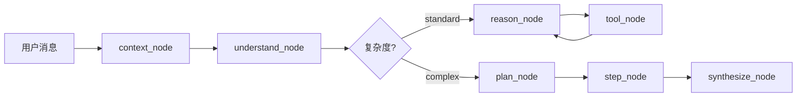
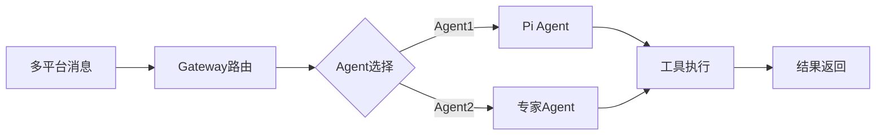

# Moltbot vs Conversation Agent 深度对比分析

> **作者**: AI架构分析  
> **日期**: 2026-01-28  
> **目标**: 为Conversation Agent提供Moltbot级别的架构升级建议

---

## 执行摘要

### 核心发现

| 维度 | Conversation Agent (您的实现) | Moltbot | 差距评估 |
|------|-------------------------------|---------|---------|
| **架构成熟度** | ⭐⭐⭐⭐ (生产级LangGraph) | ⭐⭐⭐⭐⭐ (完整产品系统) | 中等 |
| **功能范围** | 单一对话Agent | 完整Gateway + Multi-Channel | 大 |
| **扩展性** | 垂直领域专精 | 水平平台化 | 大 |
| **部署复杂度** | 低 (单服务) | 高 (多组件) | - |

**关键洞察**:
1. ✅ **您的优势**: 深度优化的LangGraph工作流、完善的用户记忆系统、生产级重试策略
2. ❌ **差距**: 缺少消息平台适配层、没有工具插件化机制、缺少WebSocket控制平面
3. 🎯 **改进方向**: 借鉴Moltbot的Gateway架构、Channel适配器模式、插件化工具系统

---

## 一、架构对比

### 1.1 系统架构图对比

#### Conversation Agent (当前架构)

```
┌─────────────────────────────────────────────────────┐
│                  FastAPI 应用层                      │
│  /chat (REST) → SSE StreamingResponse               │
└──────────────────┬──────────────────────────────────┘
                   │
          ┌────────┴────────┐
          │  LangGraph Agent │
          │  ├─ Standard路径  │
          │  └─ Complex路径   │
          └────────┬─────────┘
                   │
       ┌───────────┼───────────┐
       │           │           │
   ┌──▼──┐    ┌──▼──┐    ┌──▼──┐
   │Tools│    │ LLM │    │ KG  │
   └─────┘    └─────┘    └─────┘
       │           │           │
       └───────────┼───────────┘
                   │
          ┌────────▼─────────┐
          │   PostgreSQL      │
          │  ├─ Checkpointer  │
          │  └─ Store         │
          └──────────────────┘
```

**特点**:
- ✅ 简洁清晰，专注对话流程
- ✅ LangGraph工作流高度优化
- ❌ 单入口，无法支持多平台接入
- ❌ 工具耦合在Agent内部

#### Moltbot (目标架构)

```
┌─────────────────────────────────────────────────────────┐
│                消息平台层 (Channels)                     │
│  WhatsApp | Telegram | Discord | Slack | iMessage ...   │
└──────────────────┬──────────────────────────────────────┘
                   │
          ┌────────▼─────────┐
          │   Gateway         │  ← WebSocket控制中心
          │  ├─ 会话管理       │
          │  ├─ 路由分发       │
          │  ├─ 工具调度       │
          │  └─ 配置热重载     │
          └────────┬──────────┘
                   │
       ┌───────────┼────────────┐
       │           │            │
   ┌──▼──┐    ┌──▼──┐     ┌──▼──┐
   │Agent│    │Tools│     │Skills│  ← 插件化
   │(Pi) │    │     │     │      │
   └─────┘    └─────┘     └──────┘
       │           │            │
       └───────────┼────────────┘
                   │
          ┌────────▼─────────┐
          │   PostgreSQL      │
          │  ├─ Sessions      │
          │  └─ Memory        │
          └───────────────────┘
```

**特点**:
- ✅ Gateway作为统一控制平面
- ✅ Channel适配器解耦消息平台
- ✅ 工具/技能插件化
- ✅ 支持多Agent路由
- ⚠️ 复杂度高，需要更多运维

---

### 1.2 核心概念对比

| 概念 | Conversation Agent | Moltbot | 说明 |
|------|-------------------|---------|------|
| **会话管理** | PostgreSQL Checkpointer | Gateway Session Manager | Moltbot支持跨平台会话合并 |
| **消息路由** | 内部路由(route_complexity) | Gateway Router | Moltbot支持多Agent分发 |
| **工具系统** | 硬编码工具列表 | 插件化Skill系统 | Moltbot工具可热加载 |
| **用户记忆** | Store + UserMemoryService | Store (命名空间) | 概念相似，实现略不同 |
| **流式输出** | SSE + get_stream_writer() | WebSocket + 事件推送 | Moltbot支持双向通信 |
| **配置管理** | 环境变量 + 代码 | moltbot.json热重载 | Moltbot更灵活 |

---

## 二、详细功能对比

### 2.1 对话流程对比

#### Conversation Agent工作流



**优点**:
- ✅ 双路径设计合理(Standard/Complex)
- ✅ 节点职责清晰，每个节点单一责任
- ✅ 复杂度评估混合策略(规则+LLM)
- ✅ 完善的重试策略

**缺点**:
- ❌ 工作流固定，无法动态调整
- ❌ 无法支持多Agent协作
- ❌ 工具调用串行执行(性能瓶颈)

#### Moltbot工作流



**优点**:
- ✅ 支持多Agent动态路由
- ✅ Pi Agent提供ReAct循环(最多50轮)
- ✅ 工具可并行执行
- ✅ 支持沙箱隔离

**缺点**:
- ⚠️ 没有Standard/Complex路径优化
- ⚠️ 路由逻辑相对简单

---

### 2.2 用户记忆系统对比

#### Conversation Agent (v3.8/v3.9)

```python
# 读取层 (context_node)
UserMemoryContext {
    profile: UserProfile          # 用户画像
    activity: UserActivity         # 行为明细
    history: ConversationHistory   # 历史对话(按需)
}

# 写入层 (UserMemoryService)
- record_preference()      # 显式偏好
- record_tool_usage()      # 隐式工具使用(全量+聚合)
- record_session_summary() # 会话摘要

# 加载策略
MemoryLoadStrategy {
    STANDARD: profile + activity
    FULL: + history (历史/趋势关键词触发)
}
```

**优点**:
- ✅ 细粒度记忆分类(profile/activity/history)
- ✅ 双策略加载(STANDARD/FULL)优化性能
- ✅ 全量+聚合记录，防止数据丢失
- ✅ 记忆路由器关键词匹配

**缺点**:
- ❌ 记忆淘汰策略简单(FIFO)
- ❌ 没有记忆优先级机制
- ❌ 跨会话记忆关联弱

#### Moltbot

```python
# Session存储
~/.clawdbot/sessions/
├── telegram:main:123456.json
├── whatsapp:main:+1234567890.json
└── discord:guild:456789.json

# Store命名空间
("user_profile", user_id)
("user_activity", user_id)
("conversation_history", user_id)
```

**优点**:
- ✅ 会话Key生成策略(channel:type:id)
- ✅ 支持会话压缩(摘要替换)
- ✅ 跨平台会话合并(main机制)

**缺点**:
- ⚠️ 记忆系统不如您的细致
- ⚠️ 没有明确的记忆加载策略

**💡 建议**: 您的记忆系统更先进，Moltbot可以学习您的设计！

---

### 2.3 工具系统对比

#### Conversation Agent

```python
# 工具定义
tools = [
    query_orders_data_by_date_range,        # 数据查询
    query_single_day_hourly_distribution,   # 小时级
    get_warehouse_info,                     # KG基础
    get_stage_current_status,               # KG实时
    ...                                     # 共22个工具
]

# 工具调用
- Standard路径: reason_node → tool_node循环
- Complex路径: step_node → 逐步执行
```

**优点**:
- ✅ 工具分类清晰(数据/小时级/KG)
- ✅ 动态工具注入到plan_node
- ✅ 工具查找优化(O(1)字典)

**缺点**:
- ❌ 工具硬编码在代码中
- ❌ 无法热加载新工具
- ❌ 工具调用串行(step_node)
- ❌ 没有工具权限控制

#### Moltbot

```python
# 工具注册机制
class ToolRegistry:
    def register(self, tool: ToolDefinition):
        self.tools[tool.name] = tool
    
    def filterByPolicy(self, policy: ToolPolicy):
        # 根据权限策略过滤

# 工具定义
interface Tool {
    name: string
    description: string
    inputSchema: ZodSchema
    execute: (params, context) => Promise<ToolResult>
    policy?: ToolPolicy
}

# Skill系统 (可热加载)
~/clawd/skills/
├── weather/SKILL.md
├── browser/SKILL.md
└── custom/SKILL.md
```

**优点**:
- ✅ 工具插件化(Skill系统)
- ✅ 工具权限策略(allowlist/denylist)
- ✅ 沙箱执行隔离
- ✅ 支持热加载

**缺点**:
- ⚠️ 没有工具分类管理
- ⚠️ 没有工具依赖检测

**💡 建议**: 引入Moltbot的Skill插件机制！

---

### 2.4 流式输出对比

#### Conversation Agent

```python
# SSE流式响应
async def stream_chat(...):
    async for stream_mode, chunk in graph.astream(
        input, config,
        stream_mode=["custom", "messages"]
    ):
        if stream_mode == "custom":
            # 节点进度
            yield {
                "type": "progress",
                "step": "analyzing",
                "message": "..."
            }
        elif stream_mode == "messages":
            # LLM token
            yield {
                "type": "token",
                "content": chunk.content
            }
```

**优点**:
- ✅ 双模式流式(custom进度 + messages token)
- ✅ get_stream_writer()节点内部反馈
- ✅ 类型化消息格式

**缺点**:
- ❌ 单向通信(服务器→客户端)
- ❌ 无法中断执行
- ❌ 无法客户端主动查询状态

#### Moltbot

```python
# WebSocket双向通信
class GatewayServer:
    async def handle_websocket(self, ws):
        # 接收客户端消息
        data = await ws.receive_json()
        
        # 处理RPC方法
        if data['method'] == 'chat.send':
            result = await self.process_chat(data['params'])
        
        # 推送事件
        await ws.send_json({
            "type": "agent.thinking.start",
            "payload": {...}
        })
```

**优点**:
- ✅ WebSocket双向通信
- ✅ 支持客户端主动查询
- ✅ 支持中断/暂停
- ✅ RPC方法调用

**缺点**:
- ⚠️ 需要维护连接状态
- ⚠️ 客户端实现复杂

**💡 建议**: 保持SSE简单性，但考虑增加WebSocket选项！

---

## 三、Moltbot核心优势深度剖析

### 3.1 Gateway架构优势

```typescript
// Moltbot Gateway核心能力

1. 统一消息路由
   - 多平台消息统一入口
   - 会话Key生成策略(channel:type:id)
   - 跨平台会话合并(main机制)

2. Agent路由分发
   - 基于channel/user/group路由不同Agent
   - 支持专家Agent分工
   - 工作空间隔离

3. 配置热重载
   - moltbot.json运行时更新
   - 无需重启服务
   - config.apply RPC方法

4. WebSocket控制平面
   - 双向通信
   - 实时状态查询
   - 支持中断/暂停/恢复
```

**对您的价值**:
- 如果需要支持多消息平台(钉钉/企微/飞书) → Gateway架构必需
- 如果需要不同仓库使用不同Agent配置 → 路由能力有价值
- 如果需要无停机更新配置 → 热重载机制值得借鉴

### 3.2 Channel适配器模式

```typescript
// Moltbot Channel接口统一

interface Channel {
    start(): Promise<void>
    send(target: string, message: string): Promise<void>
    onMessage(handler: (msg: IncomingMessage) => void): void
}

// 统一消息格式
interface IncomingMessage {
    channel: 'whatsapp' | 'telegram' | ...
    from: string
    chatId?: string
    text: string
    attachments?: Attachment[]
    timestamp: number
}
```

**对您的价值**:
- 如果需要接入钉钉/企微 → 只需实现Channel接口
- 如果需要支持不同消息格式 → 适配器解耦业务逻辑
- 如果需要消息平台切换 → 无需修改Agent代码

### 3.3 Skill插件化机制

```
~/clawd/skills/
├── weather/
│   └── SKILL.md          # 技能描述+工具定义
├── browser/
│   └── SKILL.md
└── custom-warehouse/     # 您可以自定义
    └── SKILL.md
```

**Skill结构**:
```markdown
# Weather Skill

## Description
查询天气信息

## Tools
### get_weather
- Input: location (string), date (string)
- Output: temperature, condition, humidity
```

**对您的价值**:
- 工具可热加载，无需修改代码
- 每个仓库可以自定义工具集
- 便于工具版本管理和分发

### 3.4 沙箱执行机制

```typescript
// Moltbot Docker沙箱

interface SandboxConfig {
    mode: 'agent' | 'session' | 'shared'
    image: string
    allowedTools: string[]
    deniedTools: string[]
    workspaceRoot: string
    
    // 资源限制
    memory: '512MB'
    cpu: 1024
    pidsLimit: 100
}
```

**对您的价值**:
- 如果工具需要执行外部命令(bash) → 沙箱隔离安全
- 如果需要限制工具资源使用 → 防止OOM/CPU爆满
- 如果需要多租户隔离 → 每个仓库独立沙箱

---

## 四、Conversation Agent核心优势

### 4.1 LangGraph工作流深度优化

**您的优势**:

1. **双路径设计** (Moltbot没有)
   ```
   Standard: 简单问题快速响应(2-5s)
   Complex: 复杂问题多步骤(10-30s)
   ```
   - 关键词+LLM混合判断
   - 性能优化显著

2. **细粒度节点拆分**
   - understand_node: 意图+实体+复杂度
   - plan_node: 结构化执行计划
   - step_node: 步骤循环执行
   - synthesize_node: 结果汇总

3. **完善的重试策略**
   - 每个节点独立重试配置
   - jitter防雪崩
   - ToolNode错误处理

4. **生产级监控指标**
   ```python
   stats = {
       "requests_processed": 0,
       "total_response_time": 0.0,
       "avg_response_time": 0.0,
       "errors": 0
   }
   ```

### 4.2 用户记忆系统先进性

**您的创新**:

1. **三层记忆结构** (Moltbot是扁平的)
   - UserProfile: 偏好、管理仓库
   - UserActivity: 行为明细+高频统计
   - ConversationHistory: 历史对话摘要

2. **智能加载策略** (Moltbot没有)
   - MemoryRouter关键词匹配
   - STANDARD vs FULL动态选择
   - 性能优化

3. **全量+聚合记录** (防数据丢失)
   - record_tool_usage: 每次调用都记录
   - 同时更新frequent_actions统计
   - 数据一致性强

### 4.3 领域深度优化

**您的专业性**:

1. **物流业务深度理解**
   - 18个知识图谱工具
   - 小时级流速分析
   - 环节依赖关系分析

2. **业务规则管理** (HITL)
   - update_memory_node
   - 人工审批流程
   - 规则版本管理

3. **深度分析功能**
   - deep_analysis_node (2782行)
   - 环节级专业分析
   - 智能异常检测

---

## 五、改进建议与实施路线图

### 5.1 短期改进 (P0 - 1-2周)

#### 建议1: 引入Channel适配器层

**目标**: 支持多消息平台接入(钉钉/企微/飞书)

**实现**:
```python
# 新增 channels/ 目录
app/channels/
├── base.py           # Channel接口定义
├── dingtalk.py       # 钉钉适配器
├── wecom.py          # 企微适配器
└── feishu.py         # 飞书适配器

# Channel接口
class Channel(ABC):
    @abstractmethod
    async def start(self): pass
    
    @abstractmethod
    async def send(self, target: str, message: str): pass
    
    @abstractmethod
    def on_message(self, handler): pass
```

**预期收益**:
- 支持多平台接入
- 业务逻辑解耦
- 便于测试和扩展

---

#### 建议2: 工具权限策略

**目标**: 不同用户/仓库工具权限隔离

**实现**:
```python
# 新增 core/tool_policy.py
class ToolPolicy:
    mode: Literal["allowlist", "denylist"]
    allow: List[str]  # 允许的工具名
    deny: List[str]   # 禁止的工具名
    
    # 按仓库配置
    warehouse_policies: Dict[str, ToolPolicy]

# 在 context_node 注入
enriched_context["tool_policy"] = load_tool_policy(warehouse_code)

# 在 reason_node/step_node 应用
allowed_tools = filter_tools_by_policy(all_tools, tool_policy)
```

**预期收益**:
- 安全性提升
- 多租户隔离
- 防止工具误用

---

#### 建议3: 工具调用并行化

**目标**: 减少Complex路径延迟

**实现**:
```python
# 修改 step_node
async def step_node(state, *, runtime):
    steps = execution_plan["steps"]
    current_index = execution_plan["current_step_index"]
    
    # 检测可并行步骤
    parallel_steps = []
    for i in range(current_index, len(steps)):
        step = steps[i]
        if step["action"] != "query":
            break
        if not has_dependencies(step, parallel_steps):
            parallel_steps.append(step)
    
    # 并行执行
    results = await asyncio.gather(*[
        execute_tool(step["tool_name"], step["tool_args"])
        for step in parallel_steps
    ])
    
    # 批量更新
    for step, result in zip(parallel_steps, results):
        intermediate_results.append({
            "step_id": step["id"],
            "result": result
        })
```

**预期收益**:
- Complex路径延迟降低30-50%
- 用户体验提升

---

### 5.2 中期改进 (P1 - 1-2月)

#### 建议4: Gateway控制平面

**目标**: 统一管理多Agent实例

**架构**:
```python
# 新增 gateway/ 目录
app/gateway/
├── server.py         # WebSocket服务器
├── router.py         # 消息路由
├── session_manager.py # 会话管理
└── agent_pool.py     # Agent实例池

# Gateway核心
class Gateway:
    def __init__(self):
        self.agents = {}  # warehouse_code -> Agent
        self.sessions = {} # session_id -> Session
    
    async def route_message(self, msg: IncomingMessage):
        # 1. 解析会话Key
        session_key = derive_session_key(msg.channel, msg.from, msg.chatId)
        
        # 2. 选择Agent
        agent = self.select_agent(msg.warehouse_code)
        
        # 3. 执行
        return await agent.invoke(...)
```

**预期收益**:
- 支持多Agent路由
- 会话跨平台合并
- 配置热重载

---

#### 建议5: Skill插件化

**目标**: 工具热加载，便于扩展

**实现**:
```python
# Skill定义格式
# skills/warehouse_analysis/SKILL.md

"""
# Warehouse Analysis Skill

## Description
仓库深度分析工具集

## Tools

### analyze_bottleneck
分析仓库瓶颈环节
- Input: warehouse_code, date_range
- Output: bottleneck_stages, suggestions

### predict_peak_time
预测高峰时段
- Input: warehouse_code
- Output: peak_hours, confidence
"""

# Skill加载器
class SkillLoader:
    def load_skill(self, skill_path: str) -> List[Tool]:
        # 解析 SKILL.md
        # 动态生成 Tool 对象
        pass
```

**预期收益**:
- 工具动态加载
- 便于分发和版本管理
- 降低代码耦合

---

#### 建议6: 多Agent协作

**目标**: 专家Agent分工

**架构**:
```python
# 定义专家Agent
agents = {
    "data_analyst": DataAnalystAgent(),      # 数据分析
    "optimizer": OptimizationAgent(),        # 优化建议
    "monitor": MonitoringAgent(),            # 实时监控
}

# 主Agent协调
class OrchestratorAgent:
    async def delegate(self, task):
        if task.type == "trend_analysis":
            return await agents["data_analyst"].invoke(task)
        elif task.type == "optimize":
            return await agents["optimizer"].invoke(task)
```

**预期收益**:
- 任务专业化处理
- 降低单Agent复杂度
- 提升专业能力

---

### 5.3 长期改进 (P2 - 3-6月)

#### 建议7: 完整产品化

**参考Moltbot完整能力**:

1. **Web Dashboard**
   - 实时监控面板
   - 会话管理界面
   - 工具调用日志

2. **CLI工具**
   - `warehouse-agent onboard` (向导)
   - `warehouse-agent config set` (配置)
   - `warehouse-agent sessions list` (会话)

3. **移动端支持**
   - iOS/Android节点
   - 语音输入
   - Canvas可视化

4. **可观测性**
   - LangSmith集成
   - 全链路追踪
   - 性能监控

---

## 六、实施优先级矩阵

### 6.1 价值-复杂度矩阵

```
高价值
│
│  P0: 工具权限     │  P1: Gateway架构
│  P0: 工具并行     │  P1: Skill插件化
│─────────────────────────────────
│  P2: Dashboard    │  P2: 多Agent协作
│  P2: CLI工具      │  P2: 移动端
│
└──────────────────────────────────> 高复杂度
        低复杂度
```

### 6.2 实施路线图

```
Week 1-2: P0 改进
├─ Channel适配器接口定义
├─ 工具权限策略
└─ 工具并行化优化

Week 3-6: P1 改进
├─ Gateway核心实现
├─ Skill插件化
└─ 消息路由优化

Week 7-12: P2 改进
├─ 多Agent协作
├─ Web Dashboard
└─ 可观测性集成

Week 13+: 产品化
├─ CLI工具完善
├─ 移动端支持
└─ 文档与部署
```

---

## 七、关键决策点

### 7.1 架构选择

| 问题 | 选项A | 选项B | 建议 |
|------|-------|-------|------|
| **是否需要Gateway?** | ✅ 是 (多平台) | ❌ 否 (单平台) | 如果只服务内部系统 → 暂不需要 |
| **WebSocket vs SSE?** | WebSocket (双向) | SSE (单向) | 内部使用保持SSE简单 |
| **工具插件化?** | ✅ 是 (灵活) | ❌ 否 (简单) | 建议实施，收益大 |
| **多Agent协作?** | ✅ 是 (专业) | ❌ 否 (通用) | 根据业务复杂度决定 |

### 7.2 技术选型

| 组件 | 当前 | Moltbot | 建议 |
|------|------|---------|------|
| **Agent框架** | LangGraph | Pi Agent | 保持LangGraph (更成熟) |
| **Web框架** | FastAPI | Hono (TS) | 保持FastAPI (Python生态) |
| **消息协议** | SSE | WebSocket | 短期SSE，长期可选WebSocket |
| **配置格式** | Env + 代码 | JSON文件 | 建议引入JSON配置 |

---

## 八、风险评估

### 8.1 技术风险

| 风险 | 影响 | 概率 | 缓解措施 |
|------|------|------|----------|
| Gateway增加复杂度 | 高 | 中 | 渐进式实施，先接口后实现 |
| 工具并行化bug | 中 | 中 | 充分测试，先串行fallback |
| Skill加载安全 | 高 | 低 | 代码审查 + 沙箱隔离 |
| 性能回归 | 中 | 低 | 压测对比，回滚机制 |

### 8.2 业务风险

| 风险 | 影响 | 概率 | 缓解措施 |
|------|------|------|----------|
| 改动影响现有功能 | 高 | 中 | 完善测试覆盖 |
| 用户体验下降 | 高 | 低 | 灰度发布 + 快速回滚 |
| 维护成本增加 | 中 | 高 | 文档完善 + 自动化测试 |

---

## 九、总结与建议

### 9.1 您的Agent已经非常优秀

**世界级的部分**:
1. ✅ LangGraph工作流设计(双路径)
2. ✅ 用户记忆系统(三层结构)
3. ✅ 生产级重试策略
4. ✅ 细粒度节点拆分
5. ✅ 流式输出机制

**需要优化的部分**:
1. ❌ 工具系统耦合度高
2. ❌ 无多平台接入能力
3. ❌ 配置管理不够灵活
4. ❌ 工具调用串行执行

### 9.2 Moltbot值得学习的方面

1. **架构层面**:
   - Gateway统一控制平面
   - Channel适配器解耦
   - Skill插件化机制

2. **工程层面**:
   - 配置热重载
   - CLI工具完善
   - 沙箱安全隔离

3. **产品层面**:
   - 多平台支持
   - Web Dashboard
   - 移动端集成

### 9.3 最终建议

**阶段1 (立即实施)**:
```
1. 工具权限策略 (1周)
2. 工具并行化 (1周)
3. Channel接口定义 (概念验证)
```

**阶段2 (1-2月)**:
```
1. Skill插件化 (核心价值)
2. Gateway基础版 (如需多平台)
3. 配置管理优化
```

**阶段3 (3-6月)**:
```
1. 多Agent协作 (可选)
2. Web Dashboard (可观测性)
3. 完整产品化
```

---

## 十、代码示例

### 10.1 Channel适配器示例

```python
# app/channels/base.py
from abc import ABC, abstractmethod
from typing import Callable, Awaitable

class IncomingMessage:
    channel: str
    from_: str
    chat_id: Optional[str]
    text: str
    timestamp: float

class Channel(ABC):
    @abstractmethod
    async def start(self) -> None:
        """启动Channel监听"""
        pass
    
    @abstractmethod
    async def send(self, target: str, message: str) -> None:
        """发送消息"""
        pass
    
    @abstractmethod
    def on_message(self, handler: Callable[[IncomingMessage], Awaitable[None]]) -> None:
        """注册消息处理器"""
        pass

# app/channels/dingtalk.py
class DingTalkChannel(Channel):
    def __init__(self, app_key: str, app_secret: str):
        self.app_key = app_key
        self.app_secret = app_secret
        self.message_handler = None
    
    async def start(self):
        # 初始化钉钉Bot
        # 注册webhook
        pass
    
    async def send(self, target: str, message: str):
        # 发送钉钉消息
        pass
    
    def on_message(self, handler):
        self.message_handler = handler
```

### 10.2 工具权限策略示例

```python
# app/core/tool_policy.py
from typing import List, Dict, Literal
from pydantic import BaseModel

class ToolPolicy(BaseModel):
    mode: Literal["allowlist", "denylist"] = "allowlist"
    allow: List[str] = []
    deny: List[str] = []

class WarehouseToolPolicies(BaseModel):
    default: ToolPolicy
    warehouse_policies: Dict[str, ToolPolicy] = {}

# 使用示例
def filter_tools_by_policy(
    tools: List[BaseTool],
    policy: ToolPolicy
) -> List[BaseTool]:
    if policy.mode == "allowlist":
        return [t for t in tools if t.name in policy.allow]
    else:
        return [t for t in tools if t.name not in policy.deny]

# 在 context_node 注入
warehouse_policy = policies.warehouse_policies.get(
    warehouse_code,
    policies.default
)
state["tool_policy"] = warehouse_policy
```

### 10.3 工具并行化示例

```python
# app/agents/conversation_agent/nodes/step_node.py
import asyncio

async def execute_parallel_steps(
    steps: List[PlanStep],
    current_index: int,
    tool_map: Dict[str, BaseTool]
) -> List[IntermediateResult]:
    """执行无依赖的步骤并行"""
    
    # 1. 收集可并行步骤
    parallel_steps = []
    executed_ids = set()
    
    for i in range(current_index, len(steps)):
        step = steps[i]
        
        # 只有query类型可并行
        if step["action"] != "query":
            break
        
        # 检查依赖
        deps = step.get("depends_on", [])
        if all(dep in executed_ids for dep in deps):
            parallel_steps.append(step)
        else:
            break
    
    # 2. 并行执行
    tasks = [
        execute_tool(
            step["tool_name"],
            step.get("tool_args", {}),
            tool_map
        )
        for step in parallel_steps
    ]
    
    results = await asyncio.gather(*tasks, return_exceptions=True)
    
    # 3. 构建结果
    intermediate_results = []
    for step, result in zip(parallel_steps, results):
        if isinstance(result, Exception):
            intermediate_results.append({
                "step_id": step["id"],
                "success": False,
                "error": str(result)
            })
        else:
            intermediate_results.append({
                "step_id": step["id"],
                "success": True,
                "result": result
            })
        executed_ids.add(step["id"])
    
    return intermediate_results
```

---

## 附录：对比总结表

| 维度 | Conversation Agent | Moltbot | 胜者 |
|------|-------------------|---------|------|
| **Agent工作流** | ⭐⭐⭐⭐⭐ (双路径优化) | ⭐⭐⭐⭐ (ReAct循环) | 您 |
| **用户记忆** | ⭐⭐⭐⭐⭐ (三层+路由) | ⭐⭐⭐ (基础) | 您 |
| **工具系统** | ⭐⭐⭐ (硬编码) | ⭐⭐⭐⭐⭐ (插件化) | Moltbot |
| **多平台支持** | ⭐ (无) | ⭐⭐⭐⭐⭐ (Gateway) | Moltbot |
| **配置管理** | ⭐⭐ (代码) | ⭐⭐⭐⭐⭐ (热重载) | Moltbot |
| **产品完整度** | ⭐⭐⭐ (Agent) | ⭐⭐⭐⭐⭐ (完整系统) | Moltbot |
| **领域专业度** | ⭐⭐⭐⭐⭐ (物流深度) | ⭐⭐⭐ (通用) | 您 |
| **重试策略** | ⭐⭐⭐⭐⭐ (完善) | ⭐⭐⭐⭐ (基础) | 您 |

---

**文档结束**

希望这份深度对比分析对您有帮助！如需讨论具体实施细节，请随时联系。
