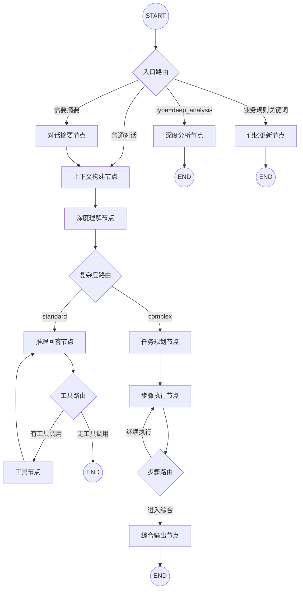

好的，我需要系统性地梳理整个 conversation_agent 的技术架构。让我先读取所有核心文件：
让我继续读取各个节点的详细实现：
让我继续读取 Complex 路径的节点和工具文件：
现在我已经阅读了所有核心文件，让我为您生成一份详细的技术文档：
我来帮你全面梳理 conversation_agent 的技术架构。首先让我读取所有核心文件，获取最新的实现状态。
让我继续读取各个核心节点的实现：
让我继续读取剩余的关键节点和其他核心模块：
我来重新读取核心文件，为你生成一份完整详细的技术文档。让我并行读取所有关键文件：
继续读取剩余核心节点和存储层文件：
我来为您整理一份完整的 conversation_agent 技术架构文档。让我先快速检查核心文件的最新状态，确保文档准确性。
让我继续读取关键节点文件，以便完整梳理技术架构：
让我继续读取工作流编译部分和其他关键文件：
让我再读取一些关键部分来完成文档：
现在我已经收集了足够的信息，让我为您生成一份完整的技术架构文档：

---

# Conversation Agent 技术架构文档
## 面向 AI 专家的深度分析与优化讨论

**版本**: v3.10  
**最后更新**: 2026-01-26  
**框架**: LangGraph 1.0  
**代码总量**: ~12,000+ 行

---

## 一、系统概述

### 1.1 核心定位

Conversation Agent 是一个**生产级 LangGraph 对话代理系统**，专为国际物流仓库运营场景设计。核心特点：

| 特性 | 描述 |
|------|------|
| **双路径架构** | Standard（快速响应）+ Complex（多步骤处理） |
| **用户记忆系统** | v3.8/v3.9 跨会话记忆，支持个性化推理 |
| **工具生态** | 20+ 个工具（数据查询 + 知识图谱 + 小时级分析） |
| **流式输出** | SSE 实时响应，`get_stream_writer()` 进度反馈 |
| **PostgreSQL 持久化** | 短期记忆（Checkpointer）+ 长期记忆（Store） |

### 1.2 技术栈

```
┌─────────────────────────────────────────────────────────────┐
│                      技术栈总览                              │
├─────────────────────────────────────────────────────────────┤
│  框架层    │ LangGraph 1.0.3 + LangChain Core               │
│  模型层    │ 通义千问 Qwen (qwen_analysis / qwen_fast)       │
│  嵌入层    │ Qwen text-embedding-v4 (1536维, 支持异步)      │
│  存储层    │ PostgreSQL 14+ (AsyncConnectionPool)          │
│  图数据库  │ PolarDB AGE (Apache AGE 兼容, Cypher)          │
│  API 层    │ FastAPI + SSE StreamingResponse                │
└─────────────────────────────────────────────────────────────┘
```

### 1.3 核心文件清单

| 文件 | 行数 | 核心职责 |
|------|------|----------|
| `production_conversation_agent.py` | 1643 | 主 Agent 类，工作流编译、路由、对话接口 |
| `core/schemas.py` | 521 | State Schema 定义（TypedDict 结构） |
| `nodes/understand_node.py` | 933 | 深度理解节点（意图+实体+复杂度） |
| `nodes/reason_node.py` | 525 | 推理回答节点（CoT + 工具调用） |
| `nodes/plan_node.py` | 1236 | 任务规划节点（Complex 路径） |
| `nodes/step_node.py` | 761 | 步骤执行节点（循环执行） |
| `nodes/synthesize_node.py` | 475 | 综合输出节点（汇总结果） |
| `nodes/deep_analysis_node.py` | 129KB | 深度分析节点（环节级专业分析） |
| `nodes/context_node.py` | 670 | 上下文构建 + 用户记忆加载 |
| `storage/postgres_manager.py` | 464 | PostgreSQL 连接池管理器 |
| `services/user_memory_service.py` | 606 | v3.9 用户记忆写入服务 |

---

## 二、LangGraph 工作流架构

### 2.1 工作流 Mermaid 图



### 2.2 双路径设计

#### Standard 路径（简单问题快速响应）
```
context_node → understand_node → reason_node → tool_node ↺ → END
```
- **适用场景**: 单一意图、直接可回答、单次工具调用
- **典型问题**: "今天杭州仓入库量多少？"
- **平均响应**: 2-5 秒

#### Complex 路径（复杂问题多步骤处理）
```
context_node → understand_node → plan_node → step_node ↺ → synthesize_node → END
```
- **适用场景**: 多意图、需多步骤、需对比分析
- **典型问题**: "对比本周和上周入库趋势，分析原因并给出优化建议"
- **平均响应**: 10-30 秒

### 2.3 入口路由逻辑

```python
def route_entry(state: ConversationState):
    """
    入口路由优先级：
    1. deep_analysis: 前端 AI 分析按钮触发
    2. summarize_conversation: 对话摘要检查（token/消息数阈值）
    3. update_memory: 业务规则管理关键词检测
    4. context_node: 普通对话（默认）
    """
    # 1. 深度分析检测（v3.5）
    if last_message.additional_kwargs.get("type") == "deep_analysis":
        return "deep_analysis_node"
    
    # 2. 对话摘要检查
    if should_summarize_conversation(state) == "summarize":
        return "summarize_conversation"
    
    # 3. 业务规则关键词
    memory_keywords = ["添加业务规则", "添加规则", "保存规则", ...]
    if any(kw in content for kw in memory_keywords):
        return "update_memory"
    
    # 4. 默认
    return "context_node"
```

---

## 三、State Schema 设计

### 3.1 核心状态结构

```python
class ConversationState(MessagesState):
    """
    对话状态 - Professional Agent v3.8
    
    继承 MessagesState 保留 messages 字段和 add_messages reducer
    """
    # ===== v1.2 已有字段 =====
    enriched_context: NotRequired[EnrichedContext]       # context_node 写入
    
    # ===== v3.8 新增字段 =====
    user_memory_context: NotRequired[UserMemoryContext]  # context_node 写入
    
    # ===== v3.1 新增字段 =====
    understanding: NotRequired[UnderstandingResult]      # understand_node 写入
    execution_plan: NotRequired[ExecutionPlan]           # plan_node 写入
    intermediate_results: NotRequired[List[IntermediateResult]]  # step_node 追加
```

### 3.2 用户记忆上下文（v3.8）

```python
class UserMemoryContext(TypedDict):
    """
    用户记忆上下文 - 注入到 State 供后续节点使用
    
    加载策略：
    - standard: profile + activity（大多数场景）
    - full: profile + activity + history（涉及历史/趋势/对比时）
    """
    profile: NotRequired[UserProfile]           # 用户画像（总是加载）
    activity: NotRequired[UserActivity]         # 用户活动（总是加载）
    history: NotRequired[ConversationHistory]   # 历史对话（按需加载）
    loaded_at: str
    load_strategy: str  # "standard" | "full"
```

### 3.3 运行时上下文 Schema

```python
@dataclass
class WarehouseContextSchema:
    """
    仓库静态上下文 - 用于 LangGraph context_schema
    
    这是静态运行时上下文，在 invoke() 时传入，不随节点执行变化。
    访问方式：runtime.context.warehouse_code
    """
    user_id: str = "default"
    session_id: str = "default"
    warehouse_code: Optional[str] = None
    warehouse_name: Optional[str] = None
```

---

## 四、节点详细实现

### 4.1 context_node（上下文构建节点）

**文件**: `app/agent/nodes/context_node.py` (670行)

**职责**:
1. 从 `runtime.context` 获取仓库静态上下文
2. 从消息中提取仓库覆盖
3. 从缓存加载仓库基本信息
4. 从 `runtime.store` 进行向量知识检索
5. 构建 `system_prompt` 并写入 `State.enriched_context`
6. **v3.8 新增**: 用户记忆加载与路由

**记忆路由器**:
```python
class MemoryRouter:
    """根据消息内容决定加载策略"""
    
    FULL_STRATEGY_KEYWORDS = [
        # 历史相关
        "之前", "上次", "历史", "以前", "过去",
        # 趋势相关
        "趋势", "变化", "对比", "比较", "同比", "环比",
        # 回顾相关
        "回顾", "总结", "复盘",
    ]
    
    @classmethod
    def determine_strategy(cls, message: str) -> MemoryLoadStrategy:
        for keyword in cls.FULL_STRATEGY_KEYWORDS:
            if keyword in message:
                return MemoryLoadStrategy.FULL
        return MemoryLoadStrategy.STANDARD
```

**重试策略**:
```python
CONTEXT_NODE_RETRY_POLICY = RetryPolicy(
    max_attempts=3,
    initial_interval=1.0,
    backoff_factor=2.0,
    retry_on=Exception
)
```

### 4.2 understand_node（深度理解节点）

**文件**: `app/agent/agents/conversation_agent/nodes/understand_node.py` (933行)

**职责**:
1. 意图识别：`query_data` / `analyze_trend` / `compare` / `optimize` / `general_qa`
2. 实体提取：仓库、时间范围、指标、环节
3. 复杂度评估：`standard` / `complex`（决定后续路由）

**混合策略设计**:
```python
# 1. 规则层快速判断（O(n) 关键词匹配）
def quick_complexity_check(message: str) -> Optional[Literal["standard", "complex"]]:
    """规则层快速判断复杂度"""
    COMPLEX_KEYWORDS = [
        "对比", "比较", "分析", "趋势", "变化", "优化", "规划",
        "为什么", "如何改进", "建议", "报告", "总结",
    ]
    for keyword in COMPLEX_KEYWORDS:
        if keyword in message:
            return "complex"
    return None  # 无法确定，交给 LLM

# 2. LLM 层准确判断（当规则层无法确定时）
async def llm_understanding(message, warehouse_code, user_memory_context):
    """LLM 结构化输出"""
    # 使用 with_structured_output 避免 JSON 泄漏
```

**输出结构**:
```python
class UnderstandingResult(TypedDict):
    intent: Literal["query_data", "analyze_trend", "compare", "optimize", "general_qa"]
    high_level_goal: NotRequired[str]       # v3.7: 一句话任务描述
    entities: ExtractedEntities
    complexity: Literal["standard", "complex"]
    complexity_reason: NotRequired[str]
    requires_data: bool
    sub_questions: NotRequired[List[str]]   # 复杂问题分解
    followup_suggestions: NotRequired[List[str]]  # v3.7: 灵活补充建议
```

### 4.3 reason_node（推理回答节点）

**文件**: `app/agent/agents/conversation_agent/nodes/reason_node.py` (525行)

**职责**:
1. 从 State 读取 `understanding` 和 `enriched_context`
2. 基于意图进行针对性推理
3. 使用 Chain-of-Thought (CoT) 增强推理能力
4. 决定是否需要工具调用
5. **v3.9 新增**: 工具使用记录（全量记录 + 聚合）
6. **v3.10 新增**: 意图专用 CoT 模板

**意图专用 CoT 模板** (v3.10):
```python
INTENT_SPECIFIC_COT_TEMPLATES = {
    "query_data": """
## 🧠 数据查询推理框架

### 查询思考过程
1. **识别数据维度**：仓库、时间范围、业务方向、环节
2. **选择查询工具**：根据维度选择合适的工具
3. **解析查询结果**：提取关键数据字段
4. **格式化输出**：使用表格展示对比数据

### ⚠️ 数据查询约束
- 如果数据缺失，明确说明"数据暂时无法获取，可能原因：..."
- **严禁编造数据**：所有数据必须来自工具调用结果
""",

    "analyze_trend": """## 🧠 趋势分析推理框架...""",
    "compare": """## 🧠 对比分析推理框架...""",
    "optimize": """## 🧠 优化建议推理框架...""",
    "general_qa": """## 🧠 通用问答推理框架...""",
}
```

**工具使用记录** (v3.9):
```python
async def _record_tool_usage_if_needed(messages, runtime):
    """检测并记录工具使用（全量记录 + 聚合）"""
    service = get_user_memory_service(runtime.store)
    await service.record_tool_usage(
        user_id=runtime.context.user_id,
        tool_name=tool_call["name"],
        tool_params=tool_call.get("args", {})
    )
```

### 4.4 plan_node（任务规划节点）

**文件**: `app/agent/agents/conversation_agent/nodes/plan_node.py` (1236行)

**职责**:
1. 读取 `understanding`（复杂问题的子问题列表）
2. 基于意图和实体生成结构化执行计划
3. 将复杂任务分解为可执行步骤
4. 输出 `ExecutionPlan` 供 `step_node` 使用

**动态工具注入**:
```python
def create_plan_node(model=None, tools: List[BaseTool] = None) -> Callable:
    """工厂函数 - 动态工具注入到提示词"""
    
    # 动态生成工具描述
    tool_descriptions = _generate_tool_descriptions(tools)
    graph_schema = _get_graph_schema_for_planning()
    
    dynamic_system_prompt = PLANNING_SYSTEM_PROMPT_TEMPLATE.format(
        tool_descriptions=tool_descriptions,
        graph_schema=graph_schema
    )
```

**action 类型** (严格限制):
```python
# ⚠️ 只能使用以下4种 action 类型：
# 1. query: 数据查询（调用工具）
# 2. analyze: 分析计算
# 3. compare: 对比分析
# 4. synthesize: 综合总结
```

**输出结构**:
```python
class ExecutionPlan(TypedDict):
    goal: str                    # 最终目标描述
    steps: List[PlanStep]        # 执行步骤列表
    current_step_index: int      # 当前执行到的步骤索引
    max_steps: int               # 最大步骤数限制（防死循环，默认5）
    status: Literal["planning", "executing", "completed", "failed"]
```

### 4.5 step_node（步骤执行节点）

**文件**: `app/agent/agents/conversation_agent/nodes/step_node.py` (761行)

**职责**:
1. 读取 `execution_plan` 获取当前待执行步骤
2. 根据步骤类型执行对应操作
3. 将执行结果写入 `intermediate_results`
4. 更新步骤状态和 `current_step_index`
5. **v3.9 新增**: 工具使用记录

**工具查找优化** (O(1)):
```python
# 使用字典映射替代线性搜索
tool_map = {getattr(t, 'name', ''): t for t in available_tools}
tool = tool_map.get(tool_name)
```

**类型转换工具**:
```python
def _convert_to_serializable(value: Any) -> Any:
    """将不可序列化的类型转换为 Python 原生类型"""
    # Decimal -> float
    # numpy 类型 -> Python 原生类型
    # 递归处理 dict 和 list
```

**步骤路由函数**:
```python
def route_step(state: ConversationState) -> str:
    """决定继续执行还是进入综合"""
    execution_plan = state.get("execution_plan", {})
    current_index = execution_plan.get("current_step_index", 0)
    steps = execution_plan.get("steps", [])
    max_steps = execution_plan.get("max_steps", 5)
    
    # 终止条件
    if current_index >= max_steps or current_index >= len(steps):
        return "synthesize_node"
    if steps[current_index].get("action") == "synthesize":
        return "synthesize_node"
    
    return "step_node"  # 继续循环
```

### 4.6 synthesize_node（综合输出节点）

**文件**: `app/agent/agents/conversation_agent/nodes/synthesize_node.py` (475行)

**职责**:
1. 读取 `intermediate_results`（所有步骤的执行结果）
2. 读取 `execution_plan`（了解目标和步骤）
3. 使用 LLM 生成用户友好的综合回答
4. 添加 `AIMessage` 到对话历史

**v3.10 用户记忆消费**:
```python
def _format_user_context(state: ConversationState) -> str:
    """提取用户原始问题和上下文，消费用户完整记忆"""
    user_memory = state.get("user_memory_context")
    if user_memory:
        # 1. 用户偏好（必须遵循）
        profile = user_memory.get("profile", {})
        preferences = profile.get("preferences", [])
        
        # 2. 高频操作（供参考）
        activity = user_memory.get("activity", {})
        frequent_actions = activity.get("frequent_actions", [])
        
        # 3. 历史对话参考
        history = user_memory.get("history", {})
```

**回答规范**:
- 使用 Markdown 表格展示数据对比
- 分析结论控制在 3 点以内
- 使用业务语言，避免技术术语
- 突出关键发现和建议

---

## 五、用户记忆系统（v3.8/v3.9）

### 5.1 架构设计

```
┌─────────────────────────────────────────────────────────────┐
│                    用户记忆系统架构                          │
├─────────────────────────────────────────────────────────────┤
│  读取层 (context_node)                                      │
│  ├── UserProfile: 用户画像（偏好、管理仓库）                 │
│  ├── UserActivity: 行为明细 + 高频统计                      │
│  └── ConversationHistory: 历史对话摘要（按需加载）           │
├─────────────────────────────────────────────────────────────┤
│  写入层 (UserMemoryService)                                 │
│  ├── record_preference(): 偏好声明（显式）                  │
│  ├── record_tool_usage(): 工具使用（隐式）                  │
│  ├── record_session_summary(): 会话摘要（混合策略）         │
│  └── record_conclusion(): 结论沉淀（半显式）                │
├─────────────────────────────────────────────────────────────┤
│  存储层 (AsyncPostgresStore)                                │
│  ├── ("user_profile", user_id): 用户画像                    │
│  ├── ("user_activity", user_id): 用户活动                   │
│  └── ("conversation_history", user_id): 历史对话            │
└─────────────────────────────────────────────────────────────┘
```

### 5.2 记忆加载策略

```python
class MemoryLoadStrategy(Enum):
    STANDARD = "standard"  # profile + activity
    FULL = "full"          # profile + activity + history
```

| 策略 | 触发条件 | 加载内容 | 典型场景 |
|------|----------|----------|----------|
| STANDARD | 默认 | profile + activity | "今天入库量多少？" |
| FULL | 历史/趋势/对比关键词 | + history | "对比上周趋势" |

### 5.3 写入触发点

| 触发方式 | 触发节点 | 写入内容 |
|----------|----------|----------|
| 显式声明 | update_memory_node | UserProfile.preferences |
| 隐式记录 | reason_node / step_node | UserActivity.behavior_entries |
| 会话结束 | conversation_summary_node | ConversationHistory.entries |

### 5.4 UserMemoryService 核心方法

```python
class UserMemoryService:
    """用户记忆写入服务 - 全量记录 + 聚合"""
    
    async def record_preference(self, user_id, content, source):
        """记录用户偏好声明（显式）"""
        # 写入 ("user_profile", user_id)
    
    async def record_tool_usage(self, user_id, tool_name, tool_params):
        """记录工具调用（隐式，全量 + 聚合）"""
        # 写入 ("user_activity", user_id)
        # 同时更新 frequent_actions 统计
    
    async def record_session_summary(self, user_id, session_id, summary):
        """记录会话摘要（混合策略）"""
        # 写入 ("conversation_history", user_id)
```

---

## 六、存储层架构

### 6.1 PostgreSQLManager 单例模式

```python
class PostgreSQLManager:
    """生产级 PostgreSQL 管理器 - 单例模式"""
    
    _instance: Optional['PostgreSQLManager'] = None
    _initialized: bool = False
    
    async def initialize(self):
        """应用启动时调用一次"""
        # 1. 创建 AsyncConnectionPool
        self._connection_pool = AsyncConnectionPool(
            conninfo=self._connection_string,
            min_size=5, max_size=20,
            timeout=30, max_idle=300, max_lifetime=1800,
            check=AsyncConnectionPool.check_connection,  # 借出时检查
            kwargs={
                "keepalives": 1,
                "keepalives_idle": 60,
                "keepalives_interval": 10,
            }
        )
        
        # 2. 创建 Checkpointer
        self._checkpointer = AsyncPostgresSaver(self._connection_pool)
        await self._checkpointer.setup()
        
        # 3. 创建 Store (含向量索引)
        self._store = AsyncPostgresStore(self._connection_pool, index=vector_config)
        await self._store.setup()
```

### 6.2 连接池配置

| 参数 | 值 | 说明 |
|------|-----|------|
| `min_size` | 5 | 最小连接数 |
| `max_size` | 20 | 最大连接数 |
| `timeout` | 30s | 获取连接超时 |
| `max_idle` | 300s | 空闲回收时间 |
| `max_lifetime` | 1800s | 连接最大生命周期 |
| `check` | check_connection | 借出时连接检查 |
| `keepalives` | 1 | TCP KeepAlive 启用 |

### 6.3 记忆系统命名空间

| 类型 | 命名空间 | 说明 |
|------|----------|------|
| 短期记忆 | thread_id | 对话历史、状态快照 |
| 用户画像 | `("user_profile", user_id)` | 偏好、管理仓库 |
| 用户活动 | `("user_activity", user_id)` | 行为明细、高频统计 |
| 历史对话 | `("conversation_history", user_id)` | 跨会话摘要 |
| 仓库规则 | `("warehouse_rules", warehouse_code)` | 业务规则 |
| 仓库上下文 | `("warehouse_context", warehouse_code)` | 仓库基本信息 |

---

## 七、重试策略配置

### 7.1 各节点重试策略

| 节点 | max_attempts | initial_interval | backoff_factor | jitter |
|------|--------------|------------------|----------------|--------|
| context_node | 3 | 1.0s | 2.0 | ✗ |
| understand_node | 2 | 0.5s | 2.0 | ✓ |
| reason_node | 3 | 1.0s | 2.0 | ✓ |
| plan_node | 2 | 1.0s | 2.0 | ✓ |
| step_node | 2 | 1.0s | 2.0 | ✓ |
| synthesize_node | 2 | 1.0s | 2.0 | ✓ |
| tool_node | 2 | 0.5s | 1.5 | ✓ |

### 7.2 ToolNode 自定义错误处理

```python
def handle_tool_error(e: Exception) -> str:
    """自定义工具错误处理函数"""
    error_type = type(e).__name__
    error_msg = str(e)
    
    # 根据错误类型返回友好的错误信息
    if "timeout" in error_msg.lower():
        return f"工具执行超时，请稍后重试。"
    elif "connection" in error_msg.lower():
        return f"网络连接失败，请稍后重试。"
    elif "not found" in error_msg.lower():
        return f"未找到请求的资源。请检查输入参数。"
    else:
        return f"工具执行失败 ({error_type})。请尝试调整参数。"

tool_node = ToolNode(
    tools,
    handle_tool_errors=handle_tool_error  # 启用自定义错误处理
)
```

---

## 八、流式输出机制

### 8.1 get_stream_writer() 使用

```python
from langgraph.config import get_stream_writer

async def reason_node(state, *, runtime):
    writer = get_stream_writer()
    
    # 流式进度反馈
    writer({"type": "progress", "step": "analyzing", "message": "正在分析数据..."})
    
    # LLM 流式输出
    async for chunk in model.astream(messages):
        writer({"type": "content", "content": chunk.content})
    
    writer({"type": "progress", "step": "completed", "message": "分析完成"})
```

### 8.2 流式响应格式

```python
# API 返回格式
async def stream_chat(...) -> AsyncGenerator[Dict[str, Any], None]:
    yield {"type": "progress", "step": "analyzing", "message": "..."}
    yield {"type": "content", "content": "..."}
    yield {"type": "tool_call", "tool_name": "...", "args": {...}}
    yield {"type": "done", "metadata": {...}}
```

---

## 九、工具生态

### 9.1 工具分类

| 类别 | 工具数量 | 说明 |
|------|----------|------|
| 数据查询 | 1 | `query_orders_data_by_date_range` |
| 小时级分析 | 3 | 24小时流速分布查询、分解、修正 |
| 知识图谱 | 18 | 基础查询 + 实时状态 + 班组状态 + 汇总分析 |

### 9.2 核心工具接口

**统一数据查询接口** (推荐):
```python
query_orders_data_by_date_range(
    warehouse_id: str,
    start_date: str,
    end_date: str,
    data_type: Literal["predict", "actual", "combined"]
) -> Dict[str, Any]
```

**知识图谱工具集** (18个):
- 基础查询 (7): `get_warehouse_info`, `get_warehouse_stages`, ...
- 实时状态 (3): `get_stage_current_status`, `get_warehouse_realtime_overview`, ...
- 班组状态 (2): `get_team_state`, `get_warehouse_team_states`
- 仓库汇总 (1): `get_warehouse_daily_stats`（含智能分析引擎）
- 智能分析 (3): `detect_stage_anomalies`, ...
- Schema/执行 (2): `get_graph_schema`, `execute_cypher`

---

## 十、已知问题与优化方向

### 10.1 P0 - 必做（生产安全）

| 问题 | 当前状态 | 建议方案 |
|------|----------|----------|
| Checkpoint TTL | ❌ 未配置 | 添加定期清理任务 |
| Store TTL | ❌ 未配置 | 添加过期数据清理 |
| 记忆数量限制 | ⚠️ 软限制 | 强制执行 MAX_BEHAVIOR_ENTRIES |

### 10.2 P1 - 推荐（能力增强）

| 优化点 | 描述 | 预期收益 |
|--------|------|----------|
| ToolRetryMiddleware | 工具级别重试策略 | 提高工具调用成功率 |
| @before_model 中间件 | 消息裁剪 | 控制 token 消耗 |
| 并行工具调用 | 独立工具并行执行 | 减少响应时间 |

### 10.3 P2 - 考虑（高级特性）

| 方向 | 描述 | 复杂度 |
|------|------|--------|
| Multi-Agent 拆分 | 专家 Agent 分工协作 | 高 |
| LangSmith 监控 | 全链路可观测性 | 中 |
| 动态工具选择 | 基于意图的工具筛选 | 中 |

---

## 十一、性能指标

### 11.1 目标指标

| 指标 | 目标值 | 说明 |
|------|--------|------|
| 冷启动时间 | < 3s | 应用启动到就绪 |
| Standard 路径延迟 (P50) | < 3s | 简单问题响应 |
| Complex 路径延迟 (P50) | < 15s | 复杂问题响应 |
| 连接池复用率 | > 95% | 避免重复创建连接 |
| QPS 上限 | 500-1000 | 取决于 LLM 并发 |

### 11.2 监控指标

```python
self.stats = {
    "requests_processed": 0,
    "total_response_time": 0.0,
    "avg_response_time": 0.0,
    "errors": 0,
    "graph_compiled_at": None,
    "connection_pool_created_at": None,
    "last_health_check": None,
}
```

---

## 十二、给 AI 专家的讨论要点

### 12.1 架构层面

1. **双路径设计的边界判断**：当前基于关键词规则 + LLM 判断，是否可以引入更精准的分类模型？

2. **记忆路由器的触发词**：`FULL_STRATEGY_KEYWORDS` 是否覆盖完整？如何平衡加载开销与上下文完整性？

3. **Complex 路径的步骤数限制**：当前 `max_steps=5`，对于极复杂任务是否足够？

### 12.2 性能层面

1. **向量检索阻塞**：虽然使用了异步版本，但 embedding 计算仍在主线程。是否需要单独的 embedding worker？

2. **LLM 调用并行化**：`understand_node` 和 `context_node` 是否可以并行执行？

3. **工具调用去重**：相同参数的工具调用是否需要缓存？

### 12.3 记忆系统

1. **偏好冲突处理**：用户历史偏好与当前请求冲突时如何处理？

2. **记忆淘汰策略**：当前使用 FIFO，是否需要基于重要性的 LRU？

3. **跨仓库记忆共享**：用户管理多个仓库时，经验是否可以迁移？

### 12.4 可观测性

1. **节点级别追踪**：是否需要为每个节点添加独立的 trace_id？

2. **用户意图分布统计**：是否需要收集 intent 分布用于模型微调？

3. **工具失败率监控**：当前仅记录错误数，是否需要按工具类型分类？

---

**文档结束**

如需进一步深入任何章节或补充其他内容，请告知。